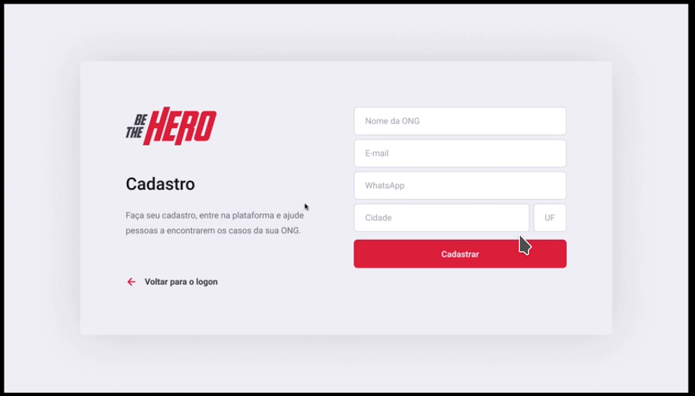

## About the frontend

This component is the frontend.

It was made in React and uses handful libraries like:

# screen shots





## How to install

Install yarn

```sh
...TODO...
```

Then install the project dependencies

```sh
yarn
```

## how to run

in development mode
```sh
yarn start
```

in production
* Depends on your server