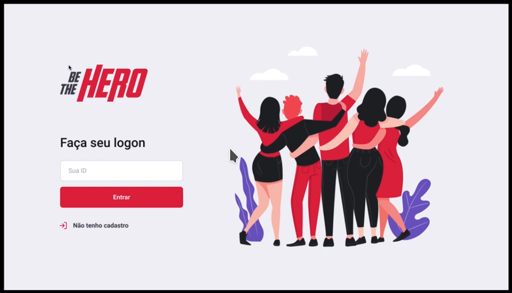
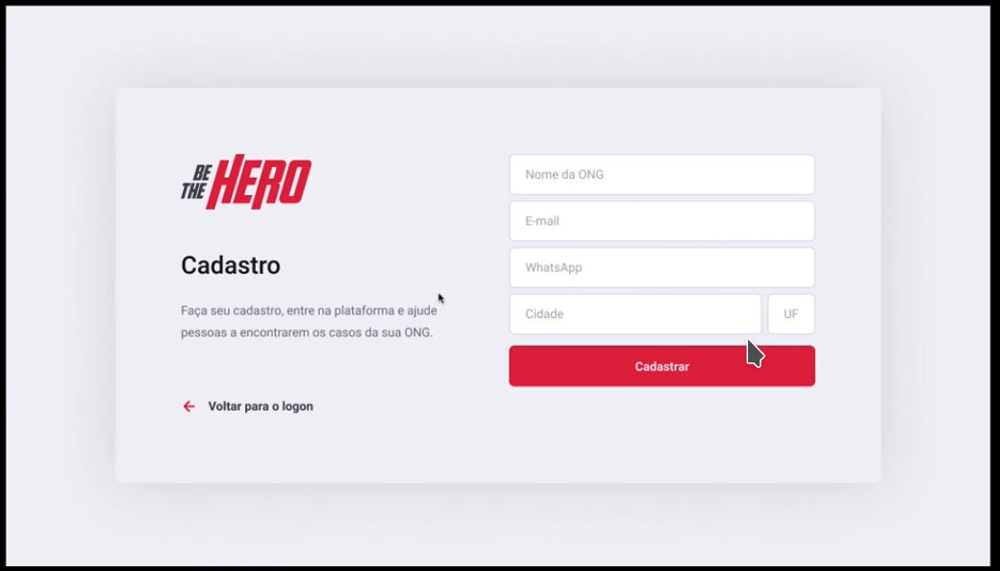
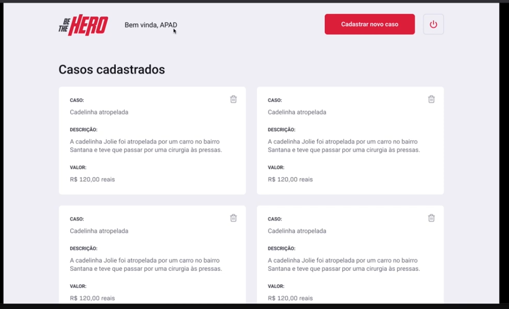
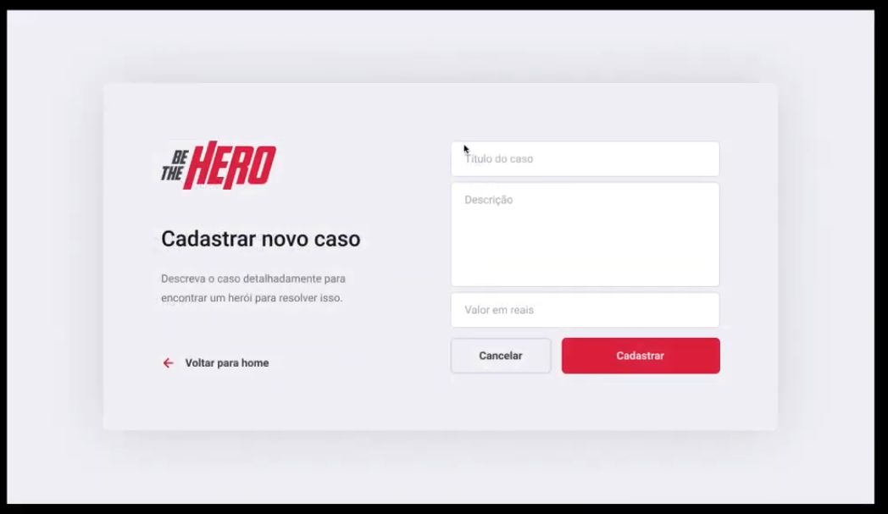

# Be the Hero - Backend

## About the project

A full stack application made in react / react native / node during the omnistack 11 by rocketseat (**add link**)

This project try to connect people who wants to help to any NGO (nonprofit organization)

For example, in Santa Catarina, Brazil, there is this NGO, the APAD, that helps injured animals (**add link**) . Such a beautiful project !!!

With this app, an NGO can logon and insert some basic info, like
- Name,
- Email,
- WhatsApp,
- City,
- State

After this, the NGO can explain the reason why for each donation, like the image below

With this app, the user can contact the NGO and HELP!!!